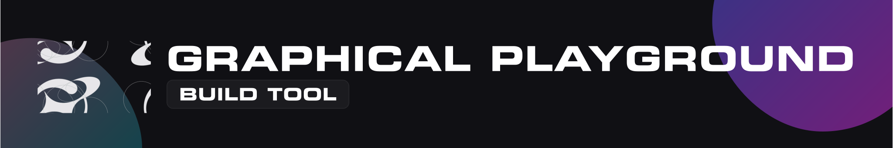

# [@graphical-playground](https://github.com/GraphicalPlayground)/gp-build-tool

**Table of content**  
[Overview](#overview)  
┕ [Getting Started](#getting-started)  
┕ [Prerequisites](#prerequisites)  
...  
[Documentation](#documentation)  
[Contributing](#contributing)  
┕ [Code of Conduct](#code-of-conduct)  
┕ [Security](#security)  
┕ [License](#license)  
┕ [Donations](#donations)  

## Overview

{{CHANGE_ME}}

### Getting Started

{{CHANGE_ME}}

### Prerequisites

{{CHANGE_ME}}

## Documentation

Comprehensive documentation for `gp-build-tool` is hosted on our main documentation portal. Whether you
are building your first triangle or writing a custom features, our guides are designed to support your
experimentation.

- [**Main Documentation Portal**](https://docs.graphical-playground.com)
- [**Engine Introduction**](https://docs.graphical-playground.com/docs/engine/intro)
- [**API Introduction**](https://docs.graphical-playground.com/docs/api/intro)

## Contributing

We welcome contributions from everybody! Whether you are fixing a bug, implementing a new features,
or improving our documentation, your help is appreciated. Please see our full
[CONTRIBUTING.md](./CONTRIBUTING.md) guide for detailed information on our standards and the pull
request review process.

### Code of Conduct

To ensure a welcoming, collaborative, and inclusive environment for everyone learning and
building within the Graphical Playground ecosystem, all contributors and participants are
expected to adhere to our [Code of Conduct](./CODE_OF_CONDUCT.md). Please review it before engaging
in community discussions or submitting code.

### Security

If you discover a security vulnerability within `gp-build-tool`, please do not report it by opening
a public issue. Instead, refer to our [Security Policy](./SECURITY.md) for instructions on how to
securely disclose the vulnerability to the maintainers.

### License

`gp-build-tool` is open-source software. Please see the [LICENSE.md](./LICENSE.md) file in the root
directory for full terms regarding modification, distribution, and use in your own projects.

### Donations

If you find `gp-build-tool` helpful for your learning, academic research, or game development journey,
please consider supporting the project. Maintaining those repositories and projects takes
significant time and resources!

You can sponsor the Graphical Playground project through the following links:

- [**Buy Me A Coffee**](https://www.buymeacoffee.com/GraphicalPlayground)
- [**GitHub Sponsors**](https://github.com/sponsors/GraphicalPlayground)
- [**Direct Donation**](https://graphical-playground.com/donate)

You can see the full list of sponsors and supporters on our
[Sponsors Page](https://graphical-playground.com/sponsors) or in [DONORS.md](./DONORS.md).
Your support helps us continue to develop high-quality educational resources and maintain the engine
for the next generation of graphics engineers.

---
© 2026 Graphical Playground. Built for the next generation of graphics engineers.
